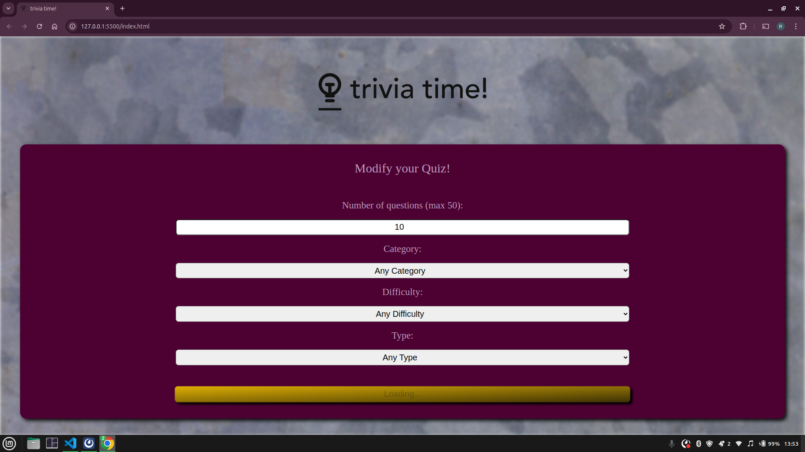
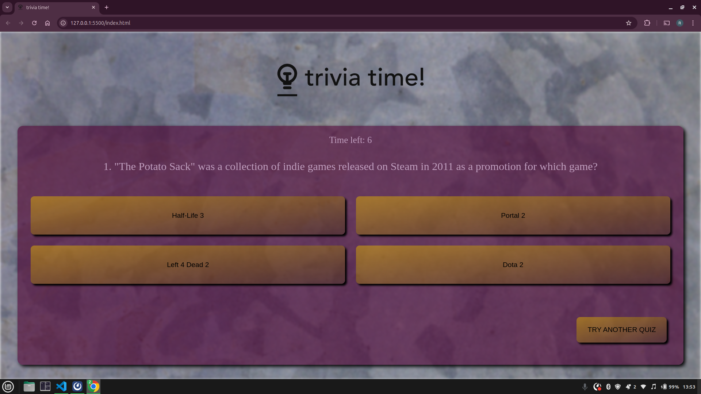
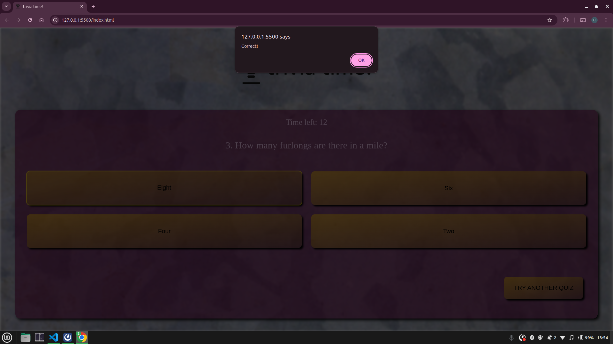
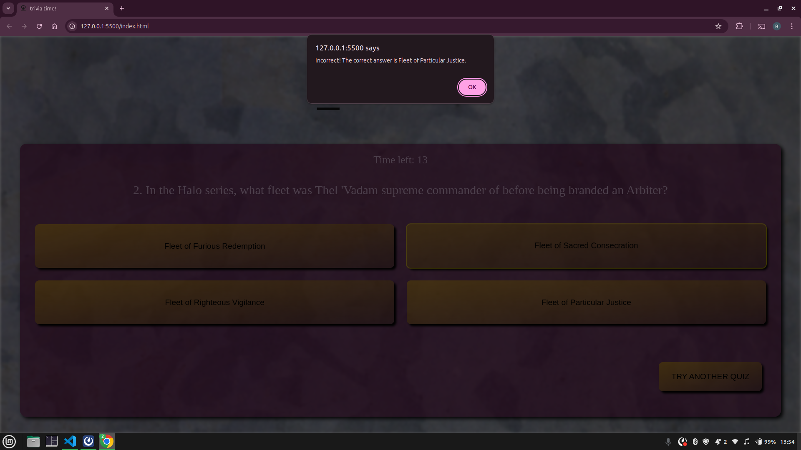
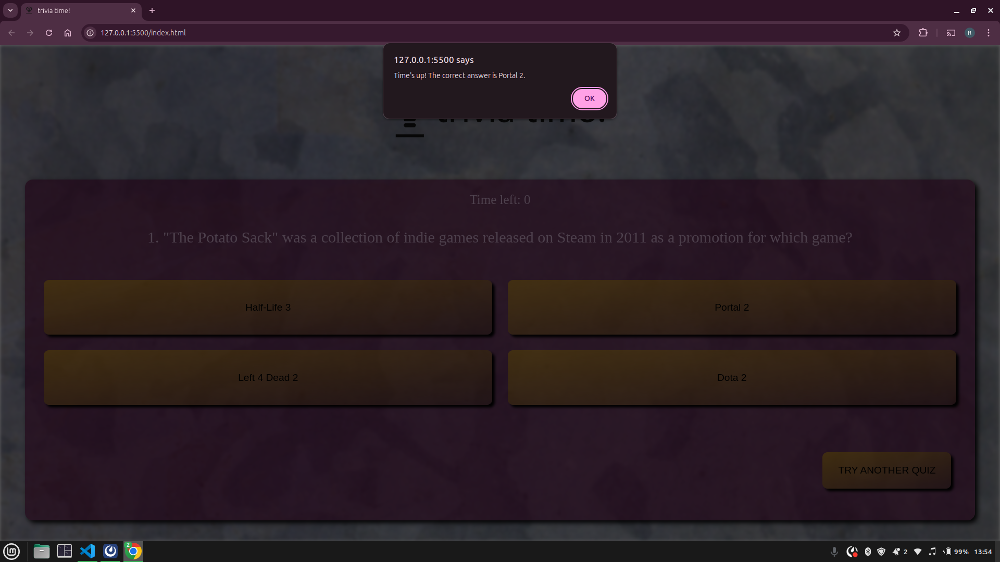
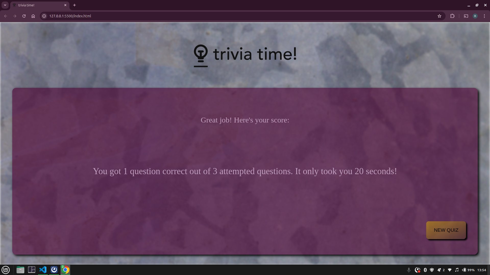

# Reagan Nyauma Trivia Project

## Description
This is a trivia quiz application that allows users to test their knowledge on various topics. Users can customize the quiz by selecting the number of questions, category, difficulty level, and question type. The app features a countdown timer for each question and displays the user's score and time taken at the end of the quiz.

## Features
- Customizable quiz options:
  - Number of questions (1–50)
  - Category (e.g., General Knowledge, Science, Vehicles)
  - Difficulty (Easy, Medium, Hard)
  - Question type (Multiple Choice, True/False)
- Countdown timer for each question.
- Displays the user's score and total time taken at the end of the quiz.
- Option to restart the quiz.

## Technologies Used
- **HTML**: For structuring the application.
- **CSS**: For styling the user interface.
- **JavaScript**: For quiz logic, timer functionality, and dynamic updates.

## How to Run the Project
1. Clone the repository:

   ```bash
   git clone <repository-url>
   ```
2. Navigate to the project directory:

    ```bash
    cd reagan-nyauma-trivia-project
    ```
3. Open the **index.html** file in your browser

    ```bash
    open index.html
    ```

## How to Use
1. Customize the quiz by selecting the number of questions, category, difficulty, and type.
2. Click the "START QUIZ" button to begin.
3. Answer each question before the timer runs out.
4. View your score and total time taken at the end of the quiz.
5. Click "NEW QUIZ" to restart.


## Screenshots
- Quiz configuration page with some options selected


- Quiz loading after "START QUIZ" is clicked



- Sample quiz question



- Notification after selecting the correct answer



- Notification after selecting the wrong answer



- Notification after running out of time



- Results page after attempting at least one question

